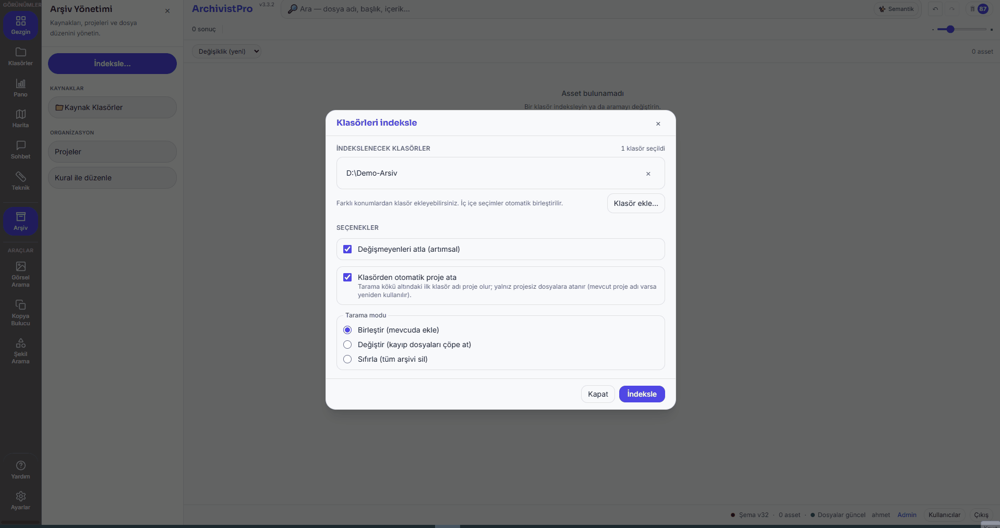
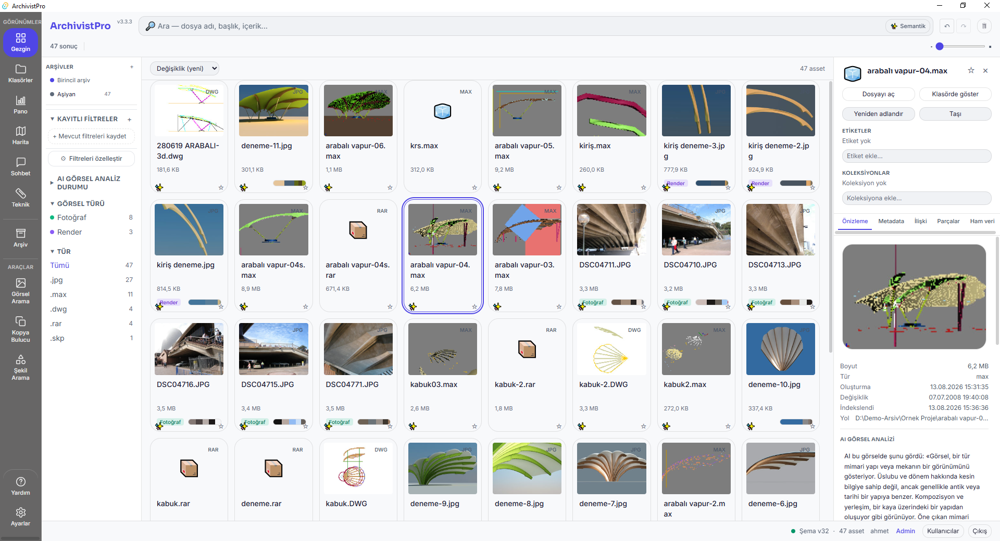
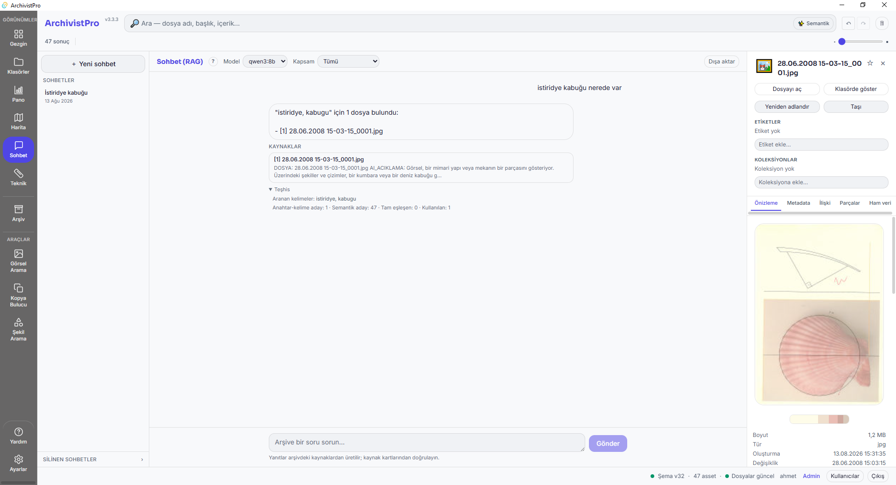
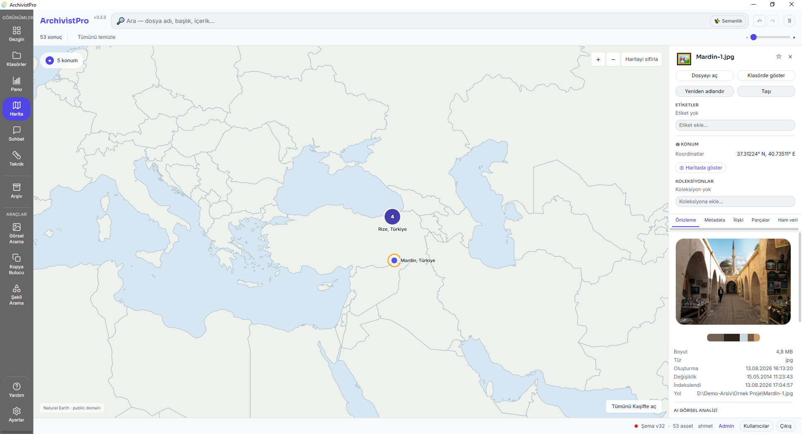
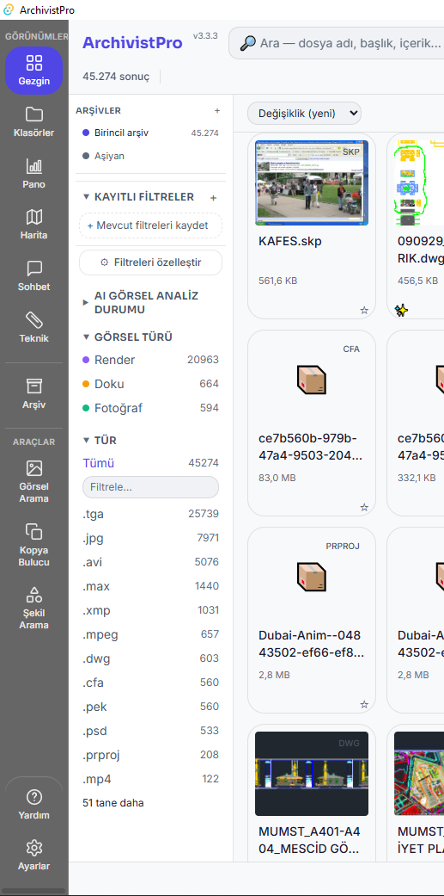

# ArchivistPro

**Fully offline archive management for architecture offices**
Your files never leave your machine. No cloud, no subscription, no account.

[Türkçe README](README.md) · [Download](https://github.com/ahmet3ddd/ArchivistPro/releases/latest) · [Install guides](docs/KULLANICI_KURULUM_REHBERI_EN.md) · [Roadmap](docs/ROADMAP.md)

> Type "corner-bay building, early republican period" — and let your archive find it.

---

## Quick start

1. **[Download the latest release](https://github.com/ahmet3ddd/ArchivistPro/releases/latest)** (Windows; pick the `..._x64-setup.exe` file)
2. Install — internet is only needed during setup
3. Point it at your archive folder and start the scan

Step-by-step walkthroughs: **[for beginners](docs/INSTALL_BEGINNER_EN.md)** · **[for system administrators](docs/INSTALL_PRO_EN.md)**
Other languages: [Türkçe](docs/KULLANICI_KURULUM_REHBERI.md) · [العربية](docs/KULLANICI_KURULUM_REHBERI_AR.md) · [日本語](docs/KULLANICI_KURULUM_REHBERI_JA.md) · [中文](docs/KULLANICI_KURULUM_REHBERI_ZH.md)

---

## What it does

| | |
|---|---|
| **File scanning** | 95+ formats including DWG, MAX, IFC, RVT, SKP, PDF; finds duplicates automatically |
| **Semantic search** | Searches by content and visual similarity, not filenames — using a fully local model |
| **Ask your archive** | Answers questions from the contents of your documents |
| **Previews** | Automatic thumbnails for DWG, 3D MAX, PSD, PDF and video |
| **Map view** | Plots geotagged photographs on a map |
| **Multiple archives** | Main + local archive; import/export via `.archivistpro` files |
| **Fully offline** | Neither your files nor your queries leave the machine |

**Requirements:** Windows 10/11 (64-bit) · 4 GB RAM (8 GB recommended) · 2 GB disk
**For AI features (optional):** [Ollama](https://ollama.com/download) plus chat/vision models. Scanning, search and duplicate detection work without them.

---

## Screenshots

**Main window** — source folders, asset grid and detail panel

**Ask your archive** — answers drawn from document contents

**Map** — geotagged photographs placed on a map

**Multiple archives** — switching between archives

---

## Why I built it

Architecture offices accumulate tens of thousands of files, and "where was that facade detail from that project" usually ends in a folder nobody remembers. Existing tools either require a cloud subscription or moving project files off-site — neither is acceptable for architectural archives.

So I wrote a tool where everything stays local and nothing depends on a subscription. It's a one-person project, and the process is in the open: development journal, technical-debt list and internal audit reports included.

- **[Roadmap](docs/ROADMAP.md)** — what's next, and what was deliberately deferred
- **[Development archive](docs/archive/)** — audit reports, plans, session notes
- **[Changelog](CHANGELOG.md)** — what changed, release by release

---

## How it works

**Tauri v2 (Rust)** + **React 19 (TypeScript)** + **SQLite**. The UI is built with web technologies but this isn't Electron — the installer stays small and memory use stays low. File scanning, thumbnail generation and cryptography live on the Rust side; the search models (text and image embeddings) ship with the app and run on-device.

More detail: **[Developer guide](docs/DEVELOPER_GUIDE.md)** · **[Security profile](docs/GUVENLIK.md)** (TR) · **[Data safety](docs/VERI_GUVENLIGI.md)** (TR)

---

## Contributing and support

- **Report a problem or suggest something:** [Issues](https://github.com/ahmet3ddd/ArchivistPro/issues)
- **Contribution guide:** [CONTRIBUTING.md](CONTRIBUTING.md)
- **Security disclosures:** [SECURITY.md](SECURITY.md)
- **In-app help:** press F1 or the **?** icon in the bottom left

Feedback at any level is welcome — "I couldn't figure out this screen" is as useful as a bug report.

> Day-to-day development happens in a private repository; this repo hosts the source and downloads for published releases. Issues here is the right place for questions and bug reports.

---

## License

[MIT](LICENSE) © 2026 Ahmet — use it, change it, ship it.
